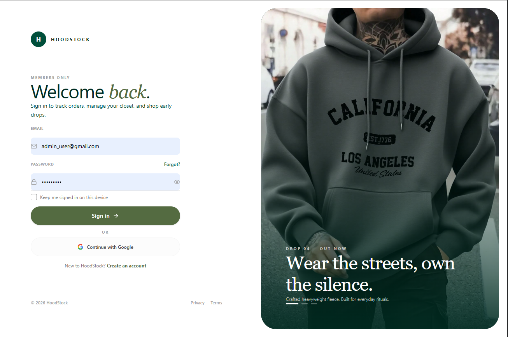

# Point-of-Sales

A web-based Point of Sale (POS) system with basic inventory management functionality. The application allows users to manage products, process sales transactions, print receipts, and monitor inventory levels through a simple and user-friendly dashboard.

## Features

- User login page

- Dashboard overview

- Product and inventory management

- Sales transaction processing

- Completed orders page &  Receipt generation

- Inventory monitoring


## Tech Stack

- React.js
- Node.js
- Express.js
- Tailwind CSS
- XAMPP
- phpMyAdmin
- MySQL

## Getting Started

### Prerequisites

Make sure the following are installed on your computer:

- Node.js
- npm
- XAMPP

### Installation

1. Clone the repository:

```bash
git clone <repository-url>
```

2. Open the project folder:

```bash
cd <project-folder>
```

3. Install dependencies for the frontend:

```bash
cd app
npm install
```

4. Install dependencies for the backend:

```bash
cd backend
npm install
```

## Running the Project

1. Open XAMPP.

2. Start the following services:

- Apache
- MySQL

3. Open phpMyAdmin and make sure the database is properly imported or created.

4. Start the backend server:

```bash
cd app/backend
npm run dev
```

5. Start the frontend:

```bash
cd app
npm run dev
```

6. Open the local development URL shown in the terminal.

## User Guide

1. Log in to the system.
2. View sales and inventory information from the dashboard.
3. Add, update, or manage products in the inventory page.
4. Process customer sales through the sales page.
5. Print or view receipts after completing a transaction.
6. Check completed orders from the orders page.

## Notes

- Make sure Apache and MySQL are running in XAMPP before starting the project.
- Make sure the backend server is running before using the frontend.
- If the database connection fails, check your MySQL database name, username, password, and backend configuration.
